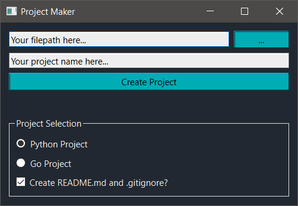

# projmake_qt
Simple Project Creator made in Qt (PySide6) and Python



A GUI version of the [command-line version](../../../../oliverchen415/pyproj) (Go version [here](../../../../oliverchen415/go_pyproj))

Now you don't even need to use the command line!

## Installation

Download the `.zip` file and unzip the contents to the folder of your choice. If you want, pin the `.exe` to the Start Menu or make a shortcut.

The executable requires **all** the files to properly run. 

Simply launch the executable and you're ready to go.

## Usage

To create a project, you need to provide a path and a project name. You can use the "..." button to browse for a folder/directory.

If you use a project name that already exists, it will fail.

Currently you can create a Python or Go project, since these two languages don't have a project manager like `dotnet` or `cargo`. 

Side note: you will still need to create a `go.mod` file for your Go project, which is noted in a tooltip if you mouse over "Go Project". To do so, use the command
```
go mod init <name>
```
Read more [here](https://blog.golang.org/using-go-modules).

Optionally, you can pick whether you want a README.md and a `.gitignore`. By default, the box is checked (it will create these files).
If you weren't planning on using Git or any version control (which is a mistake!), you can uncheck the box.
